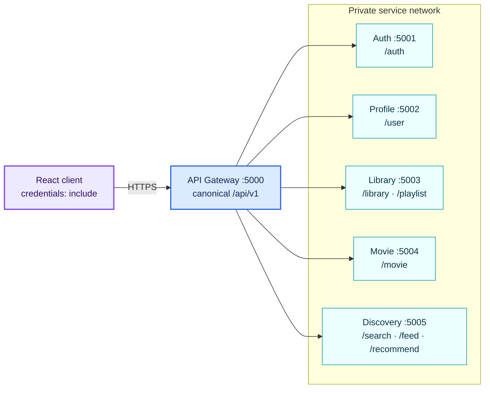
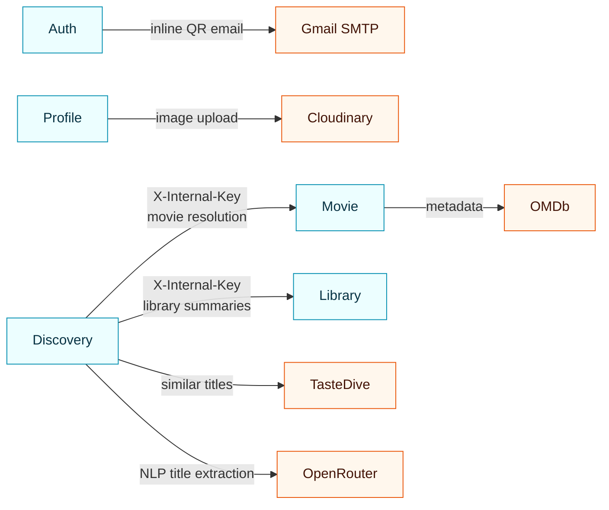
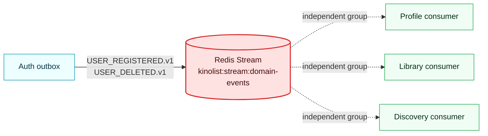
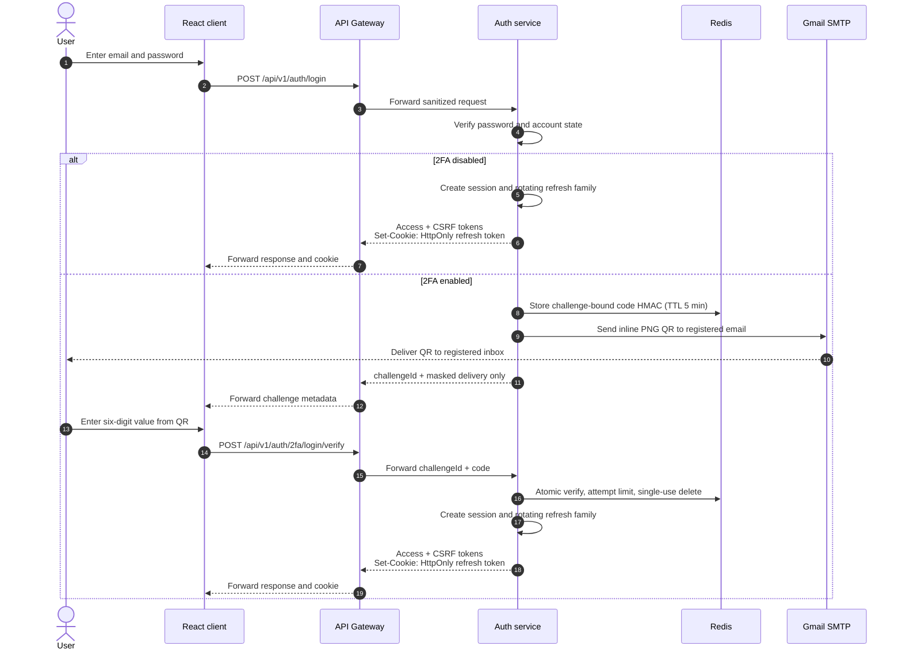
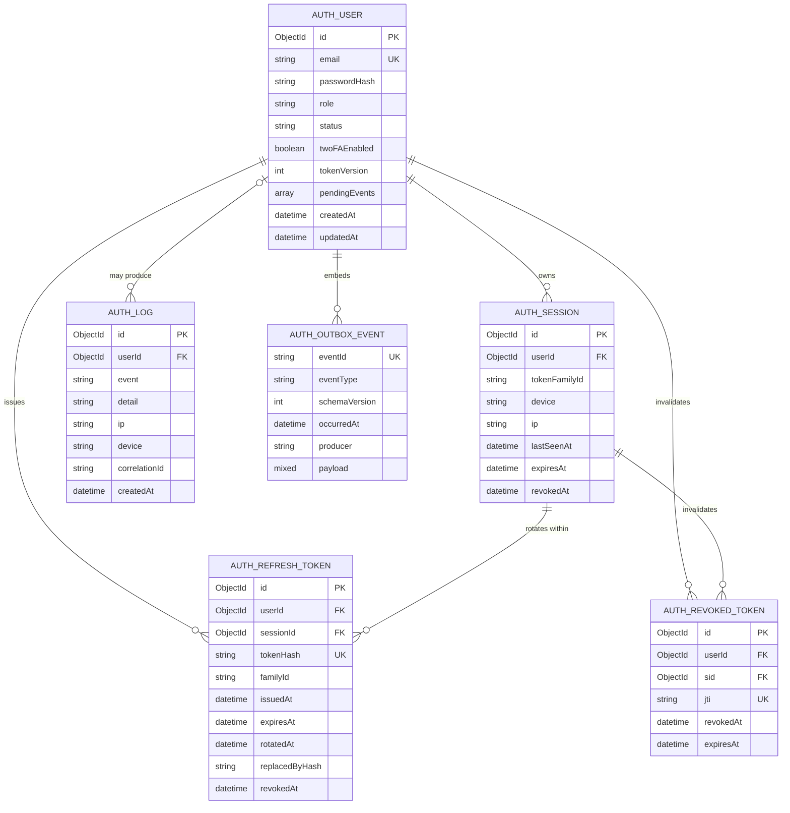
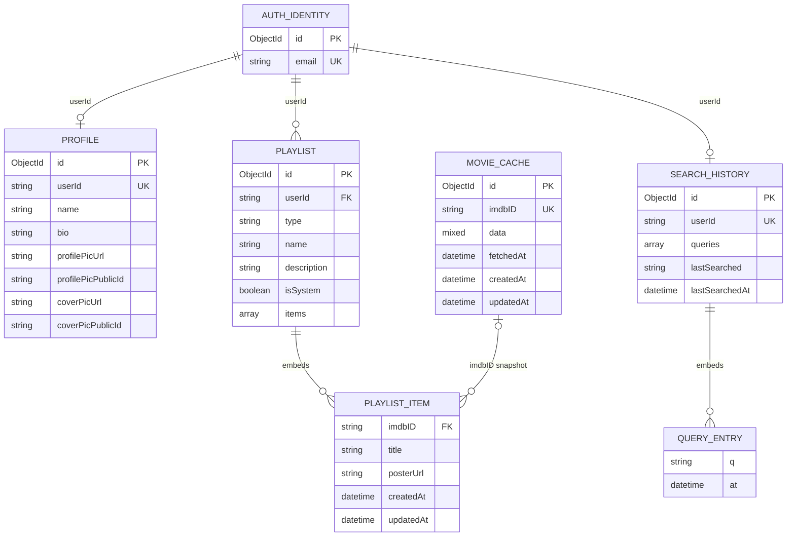
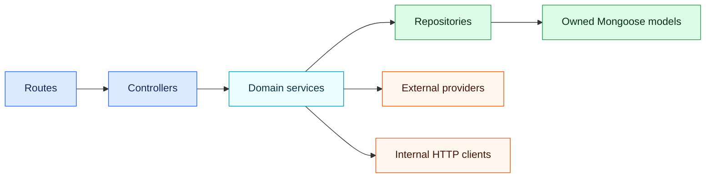

<div align="center">

# 🎬 KinoList Backend

### A security-first, event-driven backend for AI-powered movie discovery

<p>
  
  
  
  
  
  
</p>

Search films, build personal libraries, generate AI-assisted recommendations,
and protect every session behind a hardened gateway and optional email-delivered 2FA.

**Canonical API:** `http://localhost:5000/api/v1` · **Public entry point:** API Gateway only

</div>

> [!IMPORTANT]
> Clients must call the API Gateway. Individual service ports and `/internal/*`
> routes are private implementation details.

---

## 🧭 Navigate

| Explore | Build and operate |
| --- | --- |
| [Architecture](#architecture) | [Quick start](#quick-start) |
| [Data model and relationships](#data-model) | [Environment](#environment) |
| [Authentication lifecycle](#authentication) | [Observability](#observability) |
| [Domain events](#domain-events) | [API reference](#api-reference) |
| [Redis and delivery guarantees](#redis) | [Common operations](#operations) |

## ✨ What KinoList provides

| Capability | Behavior |
| --- | --- |
| Movie discovery | Keyword, genre, trending, ongoing, and natural-language AI searches |
| Personal library | Favourites, watchlist, and uniquely named custom playlists |
| Recommendations | Search-history and library-informed movie suggestions |
| Identity | RS256 access JWTs, rotating opaque refresh tokens, CSRF, session management |
| Email 2FA | Five-minute, single-use QR challenge delivered to the registered inbox through Gmail SMTP |
| Event consistency | Transactional auth outbox plus Redis Streams consumer groups and DLQ |
| Safe contracts | Versioned gateway routes, standard envelopes, explicit allowlisted DTOs |

## 🧱 Platform at a glance

| Component | Port | State | Responsibility |
| --- | ---: | --- | --- |
| `api-gateway` | `5000` | Redis | CORS, proxy trust, request limits, distributed rate limits, routing |
| `auth-service` | `5001` | `kinolist_auth` + Redis | Accounts, sessions, refresh rotation, CSRF, email 2FA, outbox |
| `profile-service` | `5002` | `kinolist_profile` | Profile text and Cloudinary image references |
| `library-service` | `5003` | `kinolist_library` | System/custom playlists and denormalized movie snapshots |
| `movie-service` | `5004` | `kinolist_movie` + Redis | OMDb normalization, persistence, caching, single-flight requests |
| `discovery-service` | `5005` | `kinolist_discovery` + Redis | Search history, feeds, AI queries, recommendations |

### Technology choices

| Concern | Implementation |
| --- | --- |
| Runtime | Node.js 20+, Express 4, native ESM |
| Persistence | MongoDB 7; one logical database per stateful service |
| Data access | Mongoose; models are never shared between services |
| Cache and messaging | Redis 7 for caches, limits, revocation state, challenges, and Streams |
| Authentication | RS256 JWT access tokens, hashed rotating refresh tokens, signed CSRF tokens |
| Integrations | OMDb, TasteDive, OpenRouter, Cloudinary, Gmail SMTP |
| Runtime topology | Docker Compose, private service network, dependency-aware health checks |

### Repository map

```text
.
├── docker-compose.yml
├── .env.example
├── scripts/
│   └── generate-jwt-keys.mjs
└── services/
    ├── api-gateway/
    ├── auth-service/
    ├── profile-service/
    ├── library-service/
    ├── movie-service/
    └── discovery-service/
```

---

<a id="architecture"></a>

## 🏗️ Architecture

### Request, dependency, and event flow

#### Public gateway routing



#### Internal calls and external providers



#### Domain-event fan-out



Solid arrows represent synchronous calls. Dotted arrows represent asynchronous
consumer-group delivery. Discovery calls Movie and Library—not the reverse.
Every stateful service owns an isolated Mongo database, detailed in the ER
diagrams below; no service reads another service's database.
<a id="authentication"></a>

### Authentication lifecycle



Registration creates the account only. It never authenticates the browser.
Credentials are created by login, and when 2FA is enabled they are withheld
until the emailed challenge succeeds.

<a id="data-model"></a>

### Data model and relationships

MongoDB does not enforce cross-database foreign keys. The diagram distinguishes:

- **solid ownership relationships** inside `kinolist_auth`;
- **embedded subdocuments** inside their parent documents;
- **logical cross-service references** carried as serialized user IDs or IMDb IDs.

#### Auth database — enforced references and embedded outbox

All entities in this diagram live in `kinolist_auth`. Relationship fields are
real indexed identifiers, although MongoDB itself still does not enforce them.



#### Cross-service model — logical references and embedded snapshots

The auth ID is serialized into service-owned documents. Playlist movie items
are snapshots: they remain usable even when the corresponding movie is not
currently present in the movie-service cache.


#### Relationship guide

| From | To | Cardinality | Enforcement and lifecycle |
| --- | --- | --- | --- |
| `AUTH_USER.id` | `AUTH_SESSION.userId` | `1 → 0..N` | Auth repository queries; session TTL and explicit revocation |
| `AUTH_SESSION.id` | `AUTH_REFRESH_TOKEN.sessionId` | `1 → 0..N` | Rotation chain; token reuse revokes the family/session |
| `AUTH_USER.id` | `AUTH_REVOKED_TOKEN.userId` | `1 → 0..N` | Access-token deny records expire through a Mongo TTL index |
| `AUTH_USER.id` | `PROFILE.userId` | `1 → 0..1` | Profile created from `USER_REGISTERED.v1`, purged on deletion |
| `AUTH_USER.id` | `PLAYLIST.userId` | `1 → 0..N` | Logical owner checked against authenticated `sub`; purged on deletion |
| `AUTH_USER.id` | `SEARCH_HISTORY.userId` | `1 → 0..1` | Created lazily by search; purged on deletion |
| `PLAYLIST.id` | `PLAYLIST_ITEM` | `1 → 0..N` | Embedded array; unique item behavior enforced by playlist service |
| `MOVIE_CACHE.imdbID` | `PLAYLIST_ITEM.imdbID` | `0..1 → 0..N` | Logical only; item contains a durable title/poster snapshot |
| `AUTH_USER` | `AUTH_OUTBOX_EVENT` | `1 → 0..N` | Embedded transactional outbox removed only after Redis `XADD` succeeds |

> [!NOTE]
> `PROFILE.userId`, `PLAYLIST.userId`, and `SEARCH_HISTORY.userId` are strings
> containing the serialized auth `ObjectId`. They are not Mongoose `ref`s.
> `PLAYLIST_ITEM` and `QUERY_ENTRY` are embedded schemas, not independent collections.
> Redis 2FA challenges and caches are ephemeral and therefore intentionally absent
> from the Mongo ER diagram.

### Data ownership boundaries

| Owner | Authoritative data | Explicitly does not own |
| --- | --- | --- |
| Auth | Email, password hash, role/status, sessions, refresh hashes, revocations, audit logs | Profile text/images, playlists, movie metadata |
| Profile | Name, bio, Cloudinary URLs/public IDs | Credentials or authorization |
| Library | Playlist metadata and compact movie snapshots | Canonical movie metadata |
| Movie | Normalized OMDb payload and fetch timestamp | User preferences |
| Discovery | Search history | Durable recommendation/feed results |
| Redis | Short-lived challenges, revocation state, caches, limits, event stream | Long-term user or movie records |

### Layer rules



- Controllers validate transport input and select response status; they never query Mongo.
- Services own business rules, orchestration, and transactional boundaries.
- Repositories are the only database access layer.
- Provider clients isolate OMDb, Cloudinary, TasteDive, OpenRouter, and SMTP.
- Peer calls use `X-Internal-Key`; the gateway strips that header from public traffic.
- Successes use `{ success, data, meta, requestId }`; errors use
  `{ success, error, requestId }`.
- DTO mappers allowlist public fields so provider payloads, ownership internals,
  password state, and secret material never escape.

### Security posture

| Control | Implementation |
| --- | --- |
| Edge trust | Spoofable identity, internal-service, and incoming forwarding headers are stripped |
| Access tokens | Short-lived JWTs with `sub`, `role`, `sid`, `jti`, `tokenVersion`, `iss`, and `aud` |
| Refresh tokens | Opaque HttpOnly cookie; SHA-256 hash at rest; rotate-on-use with family reuse detection |
| Browser writes | Session-bound signed CSRF token required alongside the refresh cookie |
| Passwords | bcrypt with configurable cost; password reauthentication for 2FA and account deletion |
| Email 2FA | Random six-digit QR; challenge-bound HMAC only; five-minute TTL; five attempts; single use |
| Authorization | Resources are scoped to the authenticated subject; profile-by-id is self-only |
| Uploads | Byte limit plus JPEG/PNG/GIF/WebP content sniffing before Cloudinary upload |
| Output safety | Standard envelope plus service-specific DTO allowlists |
| Abuse resistance | Redis-backed gateway/auth/AI rate limits and strict body/query limits |

---
<a id="domain-events"></a>

## 📨 Domain events

Events flow through the Redis Stream `kinolist:stream:domain-events`. Consumers
track their own last-read ID in Redis (consumer group/acked keys); on
processing failure a batch is pushed to the DLQ
`kinolist:stream:domain-events:dlq` and the error is logged loudly — events are
how dependent services converge, so a missed event is a consistency bug.

Auth uses an embedded transactional outbox: registration/deletion events are
written into `User.pendingEvents` in the same Mongo document mutation as the
account state change. A background dispatcher publishes them to Redis in order
and removes each entry only after `XADD` succeeds. Redis interruptions
therefore delay cleanup but cannot silently discard it.

### Envelope

Every event uses the same envelope:

```json
{
  "eventId": "uuid",
  "eventType": "USER_REGISTERED.v1",
  "schemaVersion": 1,
  "occurredAt": "2026-08-07T10:00:00.000Z",
  "producer": "auth-service",
  "correlationId": null,
  "causationId": null,
  "payload": { }
}
```

| Field          | Meaning                                                       |
| -------------- | ------------------------------------------------------------- |
| `eventId`      | unique id, generated by the producer                          |
| `eventType`    | `<NAME>.v<schemaVersion>` — bump the suffix on breaking changes |
| `schemaVersion`| integer, mirrors the suffix                                   |
| `occurredAt`   | producer timestamp (ISO-8601 UTC)                             |
| `producer`     | originating service (`auth-service`)                          |
| `correlationId`| optional end-to-end trace id                                  |
| `causationId`  | optional id of the event that caused this one                 |
| `payload`      | event-specific body                                           |

### Events

#### `USER_REGISTERED.v1` — producer `auth-service`

Emitted on successful account registration.

```json
{
  "eventType": "USER_REGISTERED.v1",
  "payload": { "userId": "…", "email": "user@example.com", "name": "Alice" }
}
```

`name` is present only when supplied at registration.

#### `USER_DELETED.v1` — producer `auth-service`

Emitted on self-service account deletion (`DELETE /api/v1/auth/account`). The
user is already marked `status: 'deleted'`, `tokenVersion` is bumped, and all
sessions/refresh tokens are revoked before the event is published, so
consumers can safely purge data without granting the actor anything.

```json
{
  "eventType": "USER_DELETED.v1",
  "payload": { "userId": "…" }
}
```

### Consumers

| Consumer            | Handles                     | On `USER_DELETED.v1`                                |
| ------------------- | --------------------------- | --------------------------------------------------- |
| profile-service     | `USER_REGISTERED.v1`        | `deleteForUser` (remove profile document)           |
| library-service     | `USER_DELETED.v1`           | `deleteForUser` (remove all playlists)              |
| discovery-service   | `USER_DELETED.v1`           | `searchHistoryRepository.deleteByUserId`            |
| movie-service       | – (stateless read-only)     | –                                                   |

### Publishing from a service

```js
import { buildEnvelope, publishEvent } from './publishers/userEvents.js';

await publishEvent(buildEnvelope('MY_EVENT.v1', 'my-service', payload, correlationId));
```

Direct publishing logs and returns `false` when `XADD` fails. Auth account
events are always queued through the embedded outbox and retried; other future
producers must provide equivalent durable queuing before mutating owned state.

---

<a id="redis"></a>

## 🧠 Redis and event delivery

| Item                          | Value                                  |
| ----------------------------- | -------------------------------------- |
| Stream                        | `kinolist:stream:domain-events`        |
| DLQ                           | `kinolist:stream:domain-events:dlq`    |
| Consumer groups               | `profile-consumer`, `library-consumer`, `discovery-consumer` |
| Entry shape                   | single field `event` = JSON envelope   |
| Read pattern                  | blocking `XREADGROUP ... BLOCK 5000` in batches of `BATCH_SIZE` (10) |
| Stale claims                  | `XAUTOCLAIM` after 30s idle            |
| Processing failure            | `XACK` the failed batch only after a successful DLQ `XADD` |
| Producer                     | `auth-service` via embedded outbox (`XADD` only after Mongo commit) |

### Redis namespace map

| Namespace                       | Used by            | Purpose                                   |
| ------------------------------- | ------------------ | ----------------------------------------- |
| `gateway:rate:*`                | gateway            | gateway-wide rate limit                   |
| `auth:rate:*`                   | auth               | per-endpoint limits (login, register, …)  |
| `auth:blacklist:*`              | auth               | revoked access-token jti                  |
| `auth:sid-revoked:*`            | auth               | session revocation marker                 |
| `auth:tv:*`                     | auth               | tokenVersion counter                      |
| `auth:csrf:<sid>`               | auth               | signed CSRF token                          |
| `auth:2fa:challenge:*`          | auth               | HMAC-only login/setup email challenges    |
| `movie:cache:*`                 | movie              | OMDb detail + search cache                |
| `discovery:cache:*`             | discovery          | feed + recommendation caches              |
| `discovery:rate:ai:*`           | discovery          | per-user paid AI search limit              |
| `kinolist:stream:domain-events` | all                | domain event stream (+ `:dlq`)            |

---

## 🐳 Docker Compose topology

```
gateway:5000 (host) → auth:5001, profile:5002, library:5003, movie:5004, discovery:5005
                        each → own mongo-<service>, shared redis
                   auth → configured Gmail SMTP relay
network: kinolist-network
```

- Every service depends on `mongo-<name>` (db `kinolist_<service>`) and the
  shared `redis`.
- Internal HTTP peers are reached via `http://<service-name>:<port>` and are
  protected by `requireInternal` middleware checking `X-Internal-Key` against
  `INTERNAL_API_KEY`.
- The gateway strips spoofable identity/service headers and incoming
  `X-Forwarded-*` values before proxying. `TRUST_PROXY` is disabled by default
  and must name exact proxy hops or CIDR ranges when deployed behind a proxy.
- Readiness checks include Redis and all five upstream services; Compose
  health checks use `/health/ready`, not liveness.

---

<a id="quick-start"></a>

## 🚀 Quick start

### 1. Prerequisites

- **Git**
- **Docker** with **Docker Compose** (v2)
- **Node.js 20+** (only for the local JWT key generator; the services
  themselves run inside Docker)

### 2. Clone

```bash
git clone https://github.com/psbcg433/kinolist_backend.git
cd kinolist_backend
```

### 3. Configure environment

Copy the template and fill in the secrets:

```bash
cp .env.example .env
```

Generate the RS256 JWT key pair and paste both keys into `.env`:

```bash
node scripts/generate-jwt-keys.mjs
```

At minimum, set the following in `.env` (all are listed in `.env.example`):

- **JWT / auth:** `JWT_ALGORITHM` (RS256), `JWT_ACCESS_PRIVATE_KEY`,
  `JWT_ACCESS_PUBLIC_KEY` (or `JWT_ACCESS_SECRET` for HS256 fallback),
  `CSRF_SECRET`, `TOTP_ENCRYPTION_KEY`
- **2FA email (Gmail SMTP):** `SMTP_USER`, `SMTP_PASS` (a 16-character Google
  App Password), `SMTP_FROM`, `SMTP_HOST`, `SMTP_PORT`, `SMTP_SECURE`
- **Internal service token:** `INTERNAL_API_KEY` (shared between services)
- **External providers:** `OMDB_API_KEY`, `OPENROUTER_API_KEY`,
  `OPENROUTER_MODEL`, `TASTEDIVE_API_KEY`,
  `CLOUDINARY_CLOUD_NAME` / `CLOUDINARY_API_KEY` / `CLOUDINARY_API_SECRET`
- **CORS / cookies:** `FRONTEND_ORIGINS` (comma-separated), and
  `COOKIE_SECURE=false` for local HTTP (must be `true` behind TLS)

> The root `.env` is the single source of secrets for Docker Compose. Each
> service folder ships its own `.env.example` too — only needed if you run a
> service outside Docker.

### 4. Build and run

```bash
docker compose up --build -d
```

Compose builds all six Node services, five Mongo databases, and Redis, wires
the internal `kinolist-network`, and starts health checks. The API is then
available at `http://localhost:5000/api/v1`.

### 5. Verify

```bash
docker compose ps                        # all services "healthy"
curl -s http://localhost:5000/health/ready | jq
```

Every service exposes `GET /health/live` and `GET /health/ready`. The gateway
readiness probe also pings all five upstreams, so a green gateway means the
whole topology is up.

---

<a id="observability"></a>

## 🔭 Observability

All services log structured JSON to stdout. Follow logs per service:

```bash
docker compose logs -f api-gateway
docker compose logs -f auth-service
docker compose logs -f profile-service
docker compose logs -f library-service
docker compose logs -f movie-service
docker compose logs -f discovery-service
```

Useful filters:

```bash
docker compose logs -f discovery-service | grep '"level":"error"'
docker compose logs -f auth-service | grep '2fa\|event'
docker compose logs -f --tail=200 api-gateway
```

Log lines carry a `requestId`; correlate a failing request end-to-end by
grepping for that id across services.

---

<a id="api-reference"></a>

## 🔌 API reference

Canonical public base URL: `http://localhost:5000/api/v1`.

The former unversioned `/api/*` routes remain temporary compatibility aliases.
New clients and the Postman collection use `/api/v1/*`.

### Response envelope

Every public, internal, health, and error response uses one envelope. Success
payloads never mirror fields at the top level:

```json
{ "success": true, "data": { ... }, "meta": {}, "requestId": "..." }
{ "success": false, "error": { "code": "...", "message": "...", "details": [] }, "requestId": "..." }
```

Success responses contain exactly `success`, `data`, `meta`, and `requestId`.
Error responses contain exactly `success`, `error`, and `requestId`.

### Gateway mapping

| Prefix             | Upstream           |
| ------------------ | ------------------ |
| `/api/v1/auth`        | auth-service:5001  |
| `/api/v1/user`        | profile-service:5002 |
| `/api/v1/playlist`    | library-service:5003 |
| `/api/v1/library`     | library-service:5003 |
| `/api/v1/movie`       | movie-service:5004 |
| `/api/v1/feed`        | discovery-service:5005 |
| `/api/v1/search`      | discovery-service:5005 |
| `/api/v1/recommend`   | discovery-service:5005 |

The gateway strips internal identity/service headers and caller-supplied
`X-Forwarded-*` headers before proxying. It then adds one canonical
`X-Forwarded-For` value derived from its explicit `TRUST_PROXY` policy.

### Auth (auth-service, port 5001)

| Method | Path                | Auth            | Notes                                   |
| ------ | ------------------- | --------------- | --------------------------------------- |
| POST   | `/auth/register`    | public, rate-limited | creates account only; returns `{ registered: true }` |
| POST   | `/auth/login`       | public, rate-limited | body `{ email, password }`          |
| POST   | `/auth/2fa/login/verify` | public, rate-limited | body `{ challengeId, code }`     |
| GET    | `/auth/csrf`        | refresh cookie   | returns `{ csrfToken }` (bootstrap)     |
| POST   | `/auth/refresh`     | cookie + CSRF, rate-limited | rotates refresh token           |
| GET    | `/auth/me`          | Bearer           | current user `{ user }`                  |
| POST   | `/auth/logout`      | Bearer **or** cookie + CSRF | clears session + cookie       |
| POST   | `/auth/logout-all`  | Bearer + CSRF    | revokes every session                    |
| GET    | `/auth/sessions`    | Bearer           | list active sessions                     |
| DELETE | `/auth/sessions/:sessionId` | Bearer   | revoke one session                       |
| POST   | `/auth/2fa/setup`   | Bearer, rate-limited | body `{ password }`; emails QR and returns challenge metadata only |
| POST   | `/auth/2fa/setup/verify` | Bearer, rate-limited | body `{ challengeId, code }`       |
| POST   | `/auth/2fa/reset`   | Bearer, rate-limited | body `{ password }`                  |
| POST   | `/auth/2fa/verify`  | Bearer, rate-limited | legacy alias; accepts `{ challengeId, token }` or `{ challengeId, code }` |
| DELETE | `/auth/account`     | Bearer + CSRF, rate-limited | body `{ password }` → self-delete |

Registration never creates a session or returns credentials. Normal login and
2FA-login-verification responses include `data.user`, `data.accessToken`
(Bearer), `data.csrfToken`, and set the `kinolist_refresh` HttpOnly cookie.
When email 2FA is enabled, a successful password check sends a PNG QR to the
registered email and returns `{ requiresTwoFactor, challengeId,
expiresInSeconds, delivery: { channel, destination } }`. It returns no QR,
code, token, cookie, or pre-verification user record. The QR contains a random
six-digit value; Redis stores only its challenge-bound HMAC for five minutes.
The challenge is single-use and locks after five invalid attempts. Access,
refresh, and CSRF credentials are issued only by successful login verification.

`user` DTO: `{ id, email, role, twoFAEnabled }`. Password state, token versions,
encrypted 2FA material, timestamps, and profile-owned fields are never returned.

### Profile (profile-service, port 5002)

| Method | Path                 | Auth  | Notes                                            |
| ------ | -------------------- | ----- | ------------------------------------------------ |
| GET    | `/user/me`           | Bearer| `{ user }` for the current user                  |
| GET    | `/user/:id`          | Bearer| self only; `data.user` using the profile DTO      |
| PUT    | `/user/update`       | Bearer| multipart `name`, `bio`, `profilePic`, `coverPic` |

`user` DTO: `{ id, name, bio, profilePic, coverPic }`
(public field names `profilePic`/`coverPic`; model stores
`profilePicUrl`/`coverPicUrl` internally). Images are sniffed (JPEG/PNG/GIF/
WEBP) and uploaded to Cloudinary, 5 MB limit.

### Library (library-service, port 5003)

Modern API:

| Method | Path                                  | Auth  | Notes                              |
| ------ | ------------------------------------- | ----- | ---------------------------------- |
| GET    | `/library/playlists`                  | Bearer| list own playlists                 |
| POST   | `/library/playlists`                  | Bearer| `{ type, name?, description? }`    |
| GET    | `/library/playlists/:playlistId`      | Bearer| single playlist                    |
| PATCH  | `/library/playlists/:playlistId`      | Bearer| rename/description (custom only)   |
| DELETE | `/library/playlists/:playlistId`      | Bearer| delete (system playlists blocked)  |
| POST   | `/library/playlists/:playlistId/items`| Bearer| `{ imdbID, title, posterUrl }` add |
| DELETE | `/library/playlists/:playlistId/items/:imdbID` | Bearer | remove item                |
| GET    | `/library/favourites`                 | Bearer| lazily-created favourites playlist |
| GET    | `/library/watchlist`                  | Bearer| lazily-created watchlist playlist  |
| GET    | `/library/summary`                    | Bearer| counts per type                     |

Playlist DTO: `{ id, type, name, description, isSystem, itemCount, items: [{ imdbId, title, posterUrl }] }`.
The owner id and database timestamps are omitted because all public library
routes operate on the authenticated user's own resources.
System playlists (`favourites`, `watchlist`) are created lazily per user and
cannot be renamed/deleted; custom playlists enforce unique names and a
per-user cap.

Legacy-input router (same service, `requireAuth`). It accepts the old request
formats but returns the same modern envelope and playlist DTO as `/library`:

| Method | Path                       | Notes                                        |
| ------ | -------------------------- | -------------------------------------------- |
| POST   | `/playlist`                | `{ type, title }` → `data.playlist`            |
| GET    | `/playlist/:userId/:type`  | system list, or custom via `type=custom&name=...` |
| PUT    | `/playlist/:playlistId/add`| `{ movie: { imdbID, title, data } }` → `data.playlist` |
| PUT    | `/playlist/:playlistId/remove` | `{ imdbID }` → `data.playlist`            |
| DELETE | `/playlist/:playlistId`    | → `data.{ deleted, playlistId }`               |

Only the item snapshots `imdbID`/`title`/`posterUrl` are stored — `data` from
the legacy client is discarded.

### Movie (movie-service, port 5004)

| Method | Path                        | Auth   | Notes                          |
| ------ | --------------------------- | ------ | ------------------------------ |
| GET    | `/movie/:imdbID`            | Bearer | `data.movie` (cache + single-flight) |

Internal (guarded by `requireInternal`, `X-Internal-Key`):

| Method | Path                  | Notes                                  |
| ------ | --------------------- | -------------------------------------- |
| GET    | `/internal/movie/:imdbID` | detail, no auth required           |
| POST   | `/internal/movie/batch`   | `{ imdbIDs: [...] }`             |
| GET    | `/internal/movie/search`  | `?q=` OMDb search, Redis-cached   |

Movie detail DTO:

```text
{ imdbId, title, year, type, posterUrl, runtime, genres, director,
  writers, actors, plot, languages, countries, imdbRating, boxOffice }
```

OMDb control fields, provider response flags, unused ratings, websites, and
other provider-specific fields are not exposed.

### Discovery (discovery-service, port 5005)

| Method | Path                            | Auth            | Notes                                  |
| ------ | ------------------------------- | --------------- | -------------------------------------- |
| GET    | `/search?q=`                    | optional (Bearer)| `data.movies`, `meta.total` |
| GET    | `/search/ai?q=`                 | Bearer, per-user rate limit | `data.movies`, `meta.total` |
| GET    | `/feed/trending`                | Bearer          | `data.movies`, `meta.total` |
| GET    | `/feed/genre/:genre`            | Bearer          | `data.movies`, `meta.total` |
| GET    | `/feed/ongoing`                 | Bearer          | `data.movies`, `meta.total` |
| GET    | `/feed/discover`                | Bearer          | `data.movies`, `meta.total` |
| GET    | `/recommend/last-search/:userId`| Bearer          | `data.movies` |
| GET    | `/recommend/search-history/:userId` | Bearer       | `data.movies` |
| GET    | `/recommend/favourites/:userId` | Bearer          | `data.movies` |
| GET    | `/recommend/watchlist/:userId`  | Bearer          | `data.movies` |

All search/feed/recommendation items use the summary DTO
`{ imdbId, title, year, type, posterUrl }`. Raw OpenRouter text, TasteDive
links/teasers, and OMDb response metadata are omitted. Searches record history
for the authenticated user; feeds and recommendations are Redis-cached.

### Internal auth

Internal routes require the `X-Internal-Key` header to match
`INTERNAL_API_KEY`. The gateway never forwards it; peer services only.

### Health endpoints

Every service (including the gateway) exposes:

| Method | Path            | Meaning                                                        |
| ------ | --------------- | -------------------------------------------------------------- |
| GET    | `/health/live`  | process is up                                                 |
| GET    | `/health/ready` | service + its dependencies are ready (Mongo, Redis, peers for the gateway/discovery) |

### Rate limits

| Limit                                | Scope            | Default                |
| ------------------------------------ | ---------------- | ---------------------- |
| Gateway-wide                         | per IP           | 300 req / 60 s         |
| Login / 2FA / register / refresh     | per IP per endpoint | 10 / 10 / 5 / 30 per 60 s |
| Delete account                       | per IP           | 5 per 60 s             |
| AI search (`/search/ai`)             | per user         | 5 per 60 s             |

### Error codes

| Status | Code                                  | Meaning                                   |
| ------ | ------------------------------------- | ----------------------------------------- |
| 400    | `VALIDATION_FAILED`                   | body/query failed validation             |
| 400    | `SYSTEM_PLAYLIST_IMMUTABLE`           | rename/delete of a system playlist       |
| 400    | `INVALID_TWO_FACTOR_CODE` / `TWO_FA_NOT_SETUP` | 2FA code or state error         |
| 401    | `UNAUTHENTICATED` / `INVALID_ACCESS_TOKEN` | missing or bad Bearer token         |
| 401    | `TOKEN_REVOKED` / `SESSION_REVOKED` / `SESSION_INVALIDATED` | session/token no longer valid |
| 401    | `TOKEN_VERSION_CHANGED`               | tokenVersion bumped (logout-all, delete) |
| 401    | `ACCOUNT_UNAVAILABLE`                 | account disabled/deleted                 |
| 401    | `NO_REFRESH_COOKIE` / `INVALID_REFRESH_TOKEN` / `REFRESH_TOKEN_EXPIRED` / `REFRESH_TOKEN_REUSE` | refresh flow failures |
| 403    | `FORBIDDEN` / `INVALID_CREDENTIALS`   | wrong password / not allowed             |
| 404    | `USER_NOT_FOUND` / `PROFILE_NOT_FOUND` / `PLAYLIST_NOT_FOUND` / `SESSION_NOT_FOUND` / `MOVIE_NOT_FOUND` | resource missing |
| 409    | `EMAIL_EXISTS` / `PLAYLIST_NAME_EXISTS` / `PLAYLIST_LIMIT_REACHED` | uniqueness/capacity conflict |
| 409    | `TWO_FA_ALREADY_ENABLED` / `TWO_FACTOR_NOT_ENABLED` | 2FA state conflict        |
| 410    | `CHALLENGE_INVALID`                   | 2FA challenge expired/used/unknown      |
| 429    | `TWO_FACTOR_CHALLENGE_LOCKED`         | too many wrong 2FA attempts             |
| 502    | `UPSTREAM_UNAVAILABLE` / `PEER_ERROR` / `PEER_UNAVAILABLE` / `IMAGE_UPLOAD_FAILED` | downstream failure |
| 503    | `AUTHORIZATION_UNAVAILABLE` / `NOT_READY` | dependency not ready               |

---

<a id="environment"></a>

## 🔐 Environment reference

All variables live in the root `.env` (see `.env.example`). Groups:

| Group            | Key(s)                                                                      |
| ---------------- | --------------------------------------------------------------------------- |
| Node             | `NODE_ENV`                                                                  |
| JWT              | `JWT_ALGORITHM`, `JWT_ACCESS_PRIVATE_KEY`, `JWT_ACCESS_PUBLIC_KEY`, `JWT_ACCESS_SECRET`, `JWT_ACCESS_TTL`, `JWT_ISSUER`, `JWT_AUDIENCE` |
| Auth secrets     | `CSRF_SECRET`, `TOTP_ENCRYPTION_KEY`, `BCRYPT_ROUNDS`, `SESSION_TTL_DAYS`, `REFRESH_TOKEN_TTL_DAYS` |
| 2FA email        | `TWO_FACTOR_CODE_TTL_SECONDS`, `TWO_FACTOR_CODE_MAX_ATTEMPTS`, `SMTP_HOST`, `SMTP_PORT`, `SMTP_SECURE`, `SMTP_REQUIRE_TLS`, `SMTP_TLS_REJECT_UNAUTHORIZED`, `SMTP_USER`, `SMTP_PASS`, `SMTP_FROM` |
| Cookies          | `COOKIE_NAME`, `COOKIE_PATH`, `COOKIE_SECURE`, `COOKIE_SAMESITE`            |
| Internal         | `INTERNAL_API_KEY`                                                          |
| Providers        | `OMDB_API_KEY`, `OPENROUTER_API_KEY`, `OPENROUTER_MODEL`, `TASTEDIVE_API_KEY`, `CLOUDINARY_CLOUD_NAME`, `CLOUDINARY_API_KEY`, `CLOUDINARY_API_SECRET` |
| CORS / proxy     | `FRONTEND_ORIGINS`, `TRUST_PROXY`                                           |
| Streams          | `REDIS_STREAM`, `REDIS_DLQ`                                                 |
| Limits           | `MAX_BODY_BYTES`, `RATE_LIMIT_WINDOW_MS`, `RATE_LIMIT_MAX`, `UPSTREAM_TIMEOUT_MS`, `RATE_LIMIT_LOGIN_MAX`, `RATE_LIMIT_REGISTER_MAX`, `RATE_LIMIT_2FA_MAX`, `RATE_LIMIT_REFRESH_MAX`, `RATE_LIMIT_DELETE_ACCOUNT_MAX`, `MAX_IMAGE_BYTES`, `MAX_ITEMS_PER_PLAYLIST`, `MAX_AI_RESULTS`, `RATE_LIMIT_AI_WINDOW_MS`, `RATE_LIMIT_AI_MAX`, `MAX_RECOMMEND_RESOLVE` |
| Caches / timeouts| `MOVIE_CACHE_TTL_SECONDS`, `DISCOVERY_FEED_CACHE_TTL`, `DISCOVERY_RECOMMEND_CACHE_TTL`, `SEARCH_HISTORY_CAP`, `OMDB_TIMEOUT_MS`, `INTERNAL_TIMEOUT_MS`, `TASTEDIVE_TIMEOUT_MS`, `OPENROUTER_TIMEOUT_MS` |

---

<a id="operations"></a>

## 🛠️ Common operations

```bash
# Rebuild after a code change
docker compose up --build -d

# Restart a single service
docker compose restart discovery-service

# Reset all data (wipes Mongo + Redis volumes)
docker compose down -v

# Tail logs with timestamps
docker compose logs -f --timestamps auth-service
```
